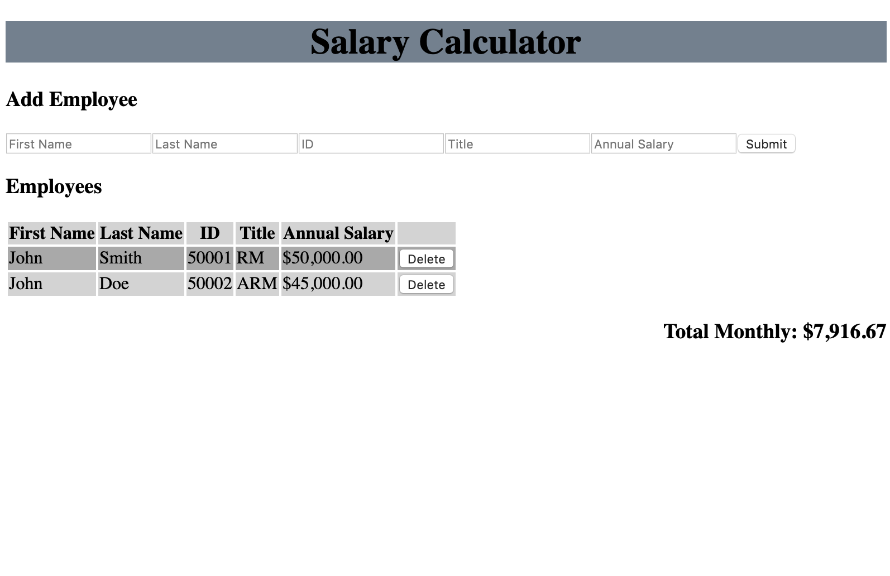

# Employee Salary Calculator
## Description
Duration: Weekend Project

A simple page to collect and display employee information. Using javascript and jQuery to allow an employer to enter an employee's name, ID number, title, and annual Salary. The page displays entered information in a table along with a running total of monthly salary costs.  The page will also warn the user when monthly costs exceed a set threshold with a red background.

## Screen Shot

## Installation
1. Clone or download project.
2. Open `index.html` in your prefered browser.
  * To change the monthly salary threshhold you will need to edit line 7 of `client.js` and reload the page.